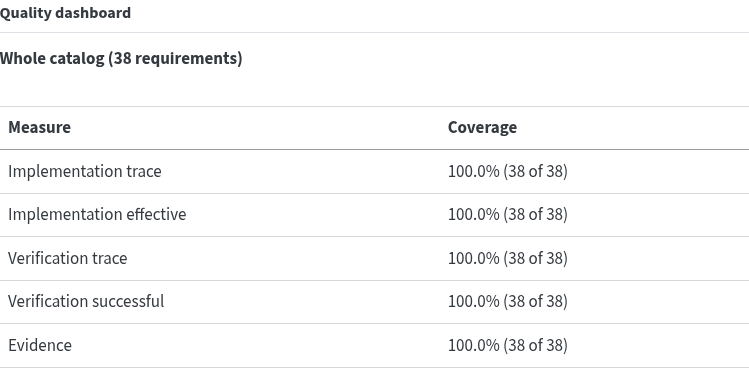
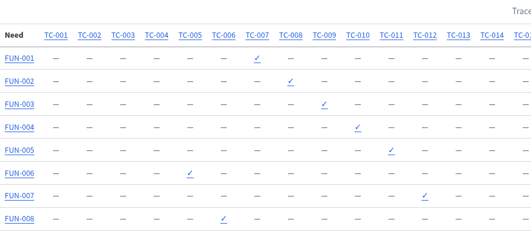
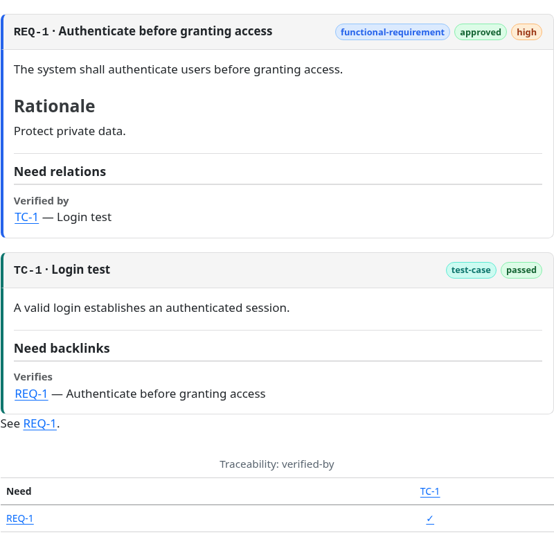

<p align="center">
  
</p>

Write requirements, architecture decisions, tests and evidence in your Quarto documents. **Quarto-Needs helps engineering teams check coverage, explain change impact and fail CI gates**, using Quarto's native HTML, PDF and DOCX publishing.

<p align="center">
  <a href="https://github.com/lsbjordao/quarto-needs/actions/workflows/ci.yml"></a>
  <a href="https://pypi.org/project/quarto-needs/"></a>
  
  
</p>

[](https://lsbjordao.github.io/quarto-needs/examples/quarto-needs/verification.html#verification-dashboard)
[](https://lsbjordao.github.io/quarto-needs/examples/quarto-needs/traceability.html#verification-matrix)

**From source to a requirement card and a traceability row:**

```markdown
::: {.need #REQ-1 type=functional-requirement status=approved priority=high verified-by=TC-1}
## Authenticate before granting access
The system shall authenticate users before granting access.

### Rationale
Protect private data.
:::

::: {.need #TC-1 type=test-case status=passed}
## Login test
A valid login establishes an authenticated session.
:::

See .


```



With [Quarto 1.6+](https://quarto.org/docs/get-started/) and an activated Python 3.10+ virtual environment, run these in an empty directory:

```bash
quarto use template lsbjordao/quarto-needs/templates/starter
quarto render
pip install quarto-needs
```

The self-hosted case study contains **198 objects**: `check` reports **0 errors, 0 warnings**, and `quality` in the **strict** profile passes **all seven gates**, with 100% implementation, verification and evidence coverage for its 41 approved requirements.

[Manual](https://lsbjordao.github.io/quarto-needs/) · [Live case study](https://lsbjordao.github.io/quarto-needs/examples/quarto-needs/) · [Quickstart](notes/quickstart.md) · [Changelog](CHANGELOG.md)

<details>
<summary>Engineering questions and long-term direction</summary>

## North star

> Quarto-Needs is a requirements, architecture-decision, verification, evidence, change-intelligence, authoring, interoperability, and engineering-traceability engine built around a typed property graph, with Quarto as its executable documentation interface.

A mature project should be able to answer from one model:

- why a requirement exists;
- which decisions address it;
- where it is implemented;
- which tests verify it;
- which evidence proves those tests ran;
- what changed between engineering states;
- what is affected and through which explicit graph path;
- which governance policies fail;
- how the model can be safely navigated/refactored in an editor;
- how requirements can be exchanged or federated without surrendering canonical identity and provenance.

</details>

## Architecture

```text
QMD / configuration / code / tests / evidence / editor buffers
                         │
                         ▼
                  Quarto-Needs Core
      parser → analysis → typed graph → rules/query → snapshot
                         │
       ┌─────────────────┼───────────────────────┬──────────────────┐
       ▼                 ▼                       ▼                  ▼
     CLI/CI       machine exports         graph projections    interchange
       │                                         │            ReqIF/JSON-LD
       ▼                                         ▼               OSLC RM
 LanguageService                         Quarto extension
       │                                  HTML/PDF/DOCX
       ▼
   LSP stdio
       │
       ▼
 VS Code / LSP clients
```

The defining constraint is simple: **one canonical engineering graph, many projections**.

## What you can do

- Author requirements, decisions, tests and evidence alongside engineering explanations.
- Check typed links, required fields, approval policies and traceability coverage.
- Enforce quality gates in CI and export JSON, CSV, SARIF, JUnit or Markdown reports.
- Capture baselines, explain change impact and identify verification claims to review.
- Validate test evidence with digests, provenance and freshness checks.
- Publish cards, tables, matrices, dashboards and navigable graphs through Quarto.
- Use LSP editor support and exchange ReqIF or JSON-LD; see the [release support contract](#release-011-support-contract) for experimental integrations.

## Repository layout

```text
src/quarto_needs/             Python semantic core, LSP and interoperability
_extensions/quarto-needs/     Canonical Quarto extension source
editors/vscode/               Thin VS Code client for the Python LSP
schemas/                      Versioned artifact schemas
tools/                        Pre-render and release tooling
docs/                         Published manual site (GitHub Pages root) — rendered
docs/src/                     Manual source (.qmd) — the book project
notes/                        Design, architecture and product notes
examples/quarto-needs/        Self-hosted engineering model
tests/                        Regression and integration tests
.github/workflows/            CI and release workflows
```

The manual is authored in `docs/src/` and rendered into `docs/`; the docs site is the GitHub Pages root. Design and product documentation that is not part of the manual lives under [`notes/`](notes/). For the end-user path, start with the [published manual](https://lsbjordao.github.io/quarto-needs/) or the standalone [`notes/quickstart.md`](notes/quickstart.md).

## Quick start

**Prerequisites:** Quarto 1.6 or later, and Python 3.10 or later with `pip` on `PATH`. The extension provisions its own Python engine; you do not install it yourself.

Add the extension to a Quarto project:

```bash
quarto add lsbjordao/quarto-needs
```

Quarto installs GitHub extensions under the owner namespace, so the canonical install lives at `_extensions/lsbjordao/quarto-needs/`. Installation does not activate a filter; add this to `_quarto.yml`:

```yaml
filters:
  - quarto-needs
```

Then render. The extension provisions its paired Python engine into a project-local managed runtime automatically:

```bash
quarto render
```

For a new project, the starter template bundles the extension and activates it for you:

```bash
quarto use template lsbjordao/quarto-needs/templates/starter
```

See [`notes/quickstart.md`](notes/quickstart.md) for the complete first-project walkthrough.

## Stability tiers

Every command, export format and integration carries a tier. Stable is covered by SemVer and breaks only in a major release; preview is tested but its interface may still change in a minor release; experimental may change or be removed at any time and warns on stderr.

- **Stable**: `scan`, `check`, `coverage`, `trace`, `export`, `quality`, `query`, `baseline`, `baseline create`, `baseline inspect`, `diff`, `impact`, `export --format json|csv|markdown`, Quarto pre-render, Documented non-C4 shortcodes.

- **Preview**: `evidence`, `evidence check`, `suspect --git BASE..HEAD`, `pr-report --git BASE..HEAD`, `github-report --git BASE..HEAD`, `diff --git BASE..HEAD`, `impact --git BASE..HEAD`, `evidence attest`, `lsp`, `export --format sarif|junit|reqif|jsonld`.

- **Experimental**: `variant list|show NAME`, `migrate SOURCE`, `oslc discover|catalog|query`, C4 projections, GitHub Issues adapter, VS Code client.

The tiers are declared once, in `src/quarto_needs/surface.py`, and this list is generated from it. See the [Stability chapter](https://lsbjordao.github.io/quarto-needs/stability.html) for what each tier promises and what a feature must demonstrate to be promoted.

## Command-line workflows

Rendering needs no separate install. Install the standalone CLI only for engineering workflows outside a render — CI gates, change reports, interchange, migration, and editor tooling:

```bash
pip install quarto-needs
```

Analyze a project:

```bash
quarto-needs scan
quarto-needs check
quarto-needs quality
quarto-needs coverage
quarto-needs trace SYS-REQ-042
```

`check` reports structural and governance findings; `quality` adds scoped coverage and the configured gates. Run against the self-hosted model in this repository:

```console
$ quarto-needs --root examples/quarto-needs check
Checked 198 objects: 0 errors, 0 warnings

$ quarto-needs --root examples/quarto-needs quality
Quarto-Needs quality report (profile=strict, reference date=2026-09-11)
Scope approved-requirements: 41 requirements
  implementation-trace: 100.0% (41/41)
  implementation-effective: 100.0% (41/41)
  verification-trace: 100.0% (41/41)
  verification-successful: 100.0% (41/41)
  evidence: 100.0% (41/41)
Findings: 0 errors, 0 warnings, 0 infos
[PASS] max-errors (actual 0, threshold 0)
[PASS] min-implementation-trace (actual 100.0, threshold 100.0, denominator 41, scope approved-requirements)
```

The paired `-trace` and `-effective`/`-successful` measures are the difference between a link existing and that link meaning something: `verification-trace` accepts a requirement that names a test case, while `verification-successful` also requires that test to be passing.

Compare engineering states:

```bash
quarto-needs baseline create
quarto-needs diff baselines/quarto-needs.json
quarto-needs impact baselines/quarto-needs.json

quarto-needs diff --git main..HEAD
quarto-needs impact --git main..HEAD
quarto-needs suspect --git main..HEAD
quarto-needs pr-report --git main..HEAD
```

Export interchange formats:

```bash
quarto-needs export --format reqif --output requirements.reqif
quarto-needs export --format jsonld --output graph.jsonld
```

Migration is review-first. `--output` writes a **migration-plan JSON**, not converted Markdown:

```bash
quarto-needs migrate sphinx-needs docs/needs.json \
  --output .quarto-needs/migrations/sphinx-needs-plan.json
```

After reviewing mappings, build an apply plan with explicit `--destination SOURCE_ID=path.qmd`; only `--apply-plan --write` mutates authored files. The same workflow supports Doorstop, StrictDoc, and OpenFastTrace. See [`docs/src/migrations.qmd`](docs/src/migrations.qmd).

Discover a configured OSLC RM Service Provider through the bounded read-only adapter:

The OSLC path needs the optional RDF dependencies:

```bash
pip install 'quarto-needs[oslc]'

quarto-needs oslc discover \
  https://provider.example/oslc/sp/requirements \
  --format json
```

Querying requires either a configured profile or the Service Provider context explicitly:

```bash
quarto-needs oslc query \
  https://provider.example/oslc/query/requirements \
  --service-provider-uri https://provider.example/oslc/sp/requirements
```

Bearer credentials are supplied by **environment-variable name**, never embedded in configuration or command output:

```bash
export MY_OSLC_TOKEN='...'
quarto-needs oslc discover \
  https://provider.example/oslc/sp/requirements \
  --bearer-token-env MY_OSLC_TOKEN
```

The GitHub Issues federation adapter remains read-only at the public integration boundary; reviewed import/apply primitives are kept explicit instead of turning external service state into implicit canonical identity.

Start the language server directly when integrating another editor:

```bash
quarto-needs --root /path/to/project lsp
```

## Authoring syntax

Quarto-Needs uses Quarto/Pandoc-native fenced divs:

```qmd
::: {.need #SYS-REQ-042 type="system-requirement" status="approved" priority="high" derives-from="STK-NEED-003" verified-by="TC-AUTH-012"}
## Authentication

The system shall authenticate the user before allowing access to private data.

### Rationale
Authentication protects private data from unauthorized access.
:::
```

Cross-reference objects with:

```qmd


```

Generated views are projections of the canonical graph:

```qmd









```

For a clickable tag index, author a chapter (say `tags.qmd`) containing ``: it renders a chip for every tag plus one table of all objects. Configure `quarto-needs: tags-page: tags` (locale-suffixed keys like `tags-page-pt-br` for translations) and every tag badge anywhere in the site becomes a link into that chapter with the filter already applied via `?tag=<slug>`.

Fourteen shortcodes are registered in total; the [views reference](https://lsbjordao.github.io/quarto-needs/views-reference.html) documents every one with its options, and the [self-hosted case study](examples/quarto-needs/) exercises all of them.

Selection is never written inside a shortcode. A `query` names a query declared once in `.quarto-needs.toml` and evaluated only by the Python core:

```toml
[queries.security-critical]
all = [
  { field = "tags", op = "contains", value = "security" },
  { field = "priority", op = "in", values = ["critical", "high"] },
]
sort = ["priority:asc", "id:asc"]
```

That one name then drives presentation and governance alike — ``, a `[gates]` scope, a `[policies.*]` scope — so the population a dashboard shows and the population a gate enforces cannot drift apart. See [named queries](https://lsbjordao.github.io/quarto-needs/named-queries.html).

## Executable evidence

Verification intent, machine execution output, and provenance-bearing evidence remain distinct. A modeled test case can bind to a real pytest node while the executable test carries reciprocal requirement/test-case markers:

```python
@pytest.mark.requirement("FUN-004")
@pytest.mark.quarto_need_test_case("TC-010")
def test_graph_exploration_assets():
    ...
```

The pytest plugin emits deterministic provider output. `evidence-envelope-v1` then records SHA-256 digest, graph/configuration fingerprints, generation time, optional Git revision, and explicit expiry. `quarto-needs evidence check` validates both artifact integrity and semantic agreement with the current engineering graph.

See [`docs/src/executable-evidence.qmd`](docs/src/executable-evidence.qmd) and [`docs/src/evidence-providers.qmd`](docs/src/evidence-providers.qmd).

## Interoperability philosophy

Interchange formats are adapters, not authoring models.

**ReqIF 1.2** provides structured requirements exchange. **JSON-LD 1.1** exposes the engineering graph as Linked Data while preserving canonical relation metadata. **OSLC RM** is a read-only federation boundary in the current pre-1.0 interface: external identity, observed bytes/digest, retrieval time, trust, cache freshness, transport limits, RDF normalization, Resource Shapes, reconciliation, and import planning remain explicit before any remote synchronization is allowed.

The OSLC path uses GET-only bounded HTTP, same-origin redirects, conditional retrieval, content-addressed cache blobs, and network-free JSON-LD/Turtle/RDFXML normalization. POST/PUT/PATCH/DELETE remain deferred until conflict, concurrency, authorization, and audit contracts exist.

## Self-hosted engineering model

`examples/quarto-needs/` models the project itself: stakeholder needs → requirements → ADRs → architecture → real source modules → modeled test cases → executable tests → evidence. English is canonical content and Brazilian Portuguese is a semantic-equivalent presentation.

The rendered case study is published at **https://lsbjordao.github.io/quarto-needs/examples/quarto-needs/**. Its local `_book/` directory is a generated build artifact and is intentionally not versioned in the source tree.

This keeps major features traceable as engineering changes rather than leaving architecture and validation implicit in implementation code.

## Contributor setup

```bash
make setup
source .venv/bin/activate
make test
```

`make setup` installs this checkout in editable mode with the test extras. Useful targets while working on the engine:

| Target | Purpose |
|---|---|
| `make test` | Full regression and integration suite. |
| `make check-self-example` | Validate the self-hosted engineering model. |
| `make evidence-self-example` | Run the bound pytest tests, write the evidence artifact, and validate it against the graph. |
| `make render-self-example` | Render the bilingual case study (depends on the evidence target). |
| `make preview-self-example` | Serve the rendered case study locally. |
| `make render-manual-multilingual` | Render the manual from `docs/src/` into `docs/`. |

Contributors can set `QUARTO_NEEDS_ENGINE_SOURCE` to a local checkout or wheel when testing an unpublished engine; remote URLs are refused. The Makefile exports `QUARTO_NEEDS_ENGINE_SOURCE=$(CURDIR)`, so example and manual renders resolve the engine from this checkout instead of the package index.

See [`CONTRIBUTING.md`](CONTRIBUTING.md) for the contribution workflow and [`ARCHITECTURE.md`](ARCHITECTURE.md) for the internal module map.

## Comparison with related tools

[`docs/src/comparison.qmd`](docs/src/comparison.qmd) compares Quarto-Needs against Sphinx-Needs, StrictDoc, Doorstop and OpenFastTrace across authoring, gating, evidence, change analysis, interchange, editor support and ecosystem. Every cell names its source, the version verified, and the date.

Read the "When not to use Quarto-Needs" section first if you are evaluating: this project is pre-1.0 with a single maintainer and no tool qualification, it offers no Sphinx-Needs compatibility, and for several use cases one of the others is the better answer.

## Inspirations and related work

Quarto-Needs has its own Quarto/Pandoc-native architecture, but it is informed by mature ideas and ecosystems:

- **Sphinx-Needs** — one of the original inspirations for first-class typed engineering objects, links, generated views, filtering, and validation. Quarto-Needs pursues capability inspiration, not Sphinx syntax compatibility.
- **Requirements as Code / Docs as Code** — text-first, Git-versioned, reviewable engineering artifacts.
- **Architecture Decision Records (ADRs)** — explicit and durable architectural rationale.
- **C4 model** — architecture projections derived from the same engineering graph rather than maintained as a parallel model.
- **ReqIF** — structured requirements interchange.
- **OSLC Requirements Management** — standards-based federation with explicit identity, provenance, caching, trust, and failure behavior.
- **StrictDoc, Doorstop, and OpenFastTrace** — reference points for requirements-as-code, traceability, review state, and transitive links.
- **Language Server Protocol** — editor interoperability without editor-specific semantic forks.
- **SARIF and JUnit** — established machine-consumable CI/reporting formats.

These are references and inspirations, not compatibility claims.

## Design principles

- Requirements as Code
- documentation as interface
- traceability as a typed property graph
- one semantic source of truth
- architecture decisions as first-class objects
- verification distinct from evidence
- authored data distinct from computed projections
- explainable change intelligence
- deterministic and reproducible artifacts
- bounded declarative policy
- progressive enhancement for interactive views
- renderer-independent semantic core
- thin editor clients
- Git/CI-first workflows
- interoperability without surrendering the canonical model

## Branding

The logo, symbol, extension icon, and palette live under [`notes/assets/branding/`](notes/assets/branding/). See [`notes/branding.md`](notes/branding.md) for the visual semantics and palette.

## License

MIT
