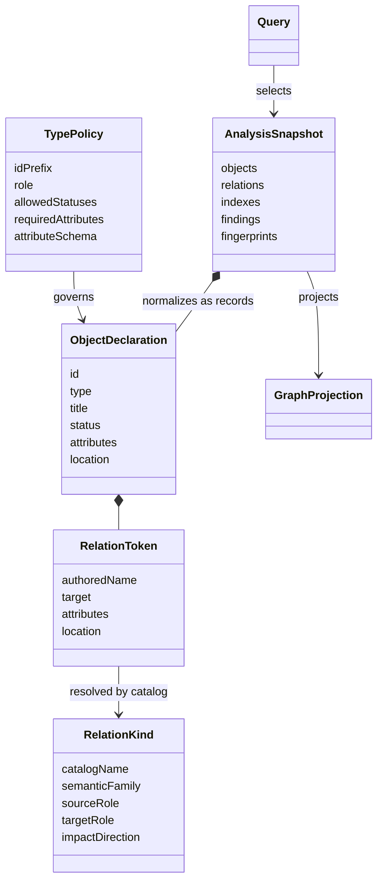

# Domain model

There is no central `Need` class with fixed subclasses. `.need` is the generic declaration syntax; concrete types and their rules come from project configuration (`[types.*]` in `.quarto-needs.toml`), validated by `config.py`.

## Conceptual model

## The four phases

1. **Declaration** (`parser.py`) — QMD `.need` blocks become `ObjectDeclaration`s with source locations; relation tokens are authored names and targets, not yet resolved.
2. **Resolution** (`relations.py`, `analysis.py`) — authored relation names resolve against the `RelationCatalog` (families, inverses, allowed source/target roles, impact/traversal direction); IDs resolve globally.
3. **Snapshot** (`snapshot.py`, `analysis.py`) — an immutable `AnalysisSnapshot`: normalized `ObjectRecord`/`RelationRecord`s, indexes, findings, fingerprints, derived fields, and variants.
4. **Projection** (`graph_projection.py`, `graph_output.py`, `c4_projection.py`) — bounded, allowlisted views over the snapshot: `needs.json`, the public graph JSON, C4 views, exports.

## What is *not* modeled

- **Links** are not a first-class aggregate. They derive from IDs, relations, `href`, and incoming/outgoing indexes.
- **A generic lifecycle state machine.** Allowed statuses are configurable per type; there is no universal transition graph for every `need`. The one real state machine in the codebase is external-source trust (`unverified → trusted/rejected/stale`, see `external_trust.py`), not object lifecycle.
- **`EngineeringObject`/`RequirementsGraph`** — earlier compatibility surfaces; the canonical model is the phases above (`ObjectDeclaration → ObjectRecord/RelationRecord → AnalysisSnapshot`).
