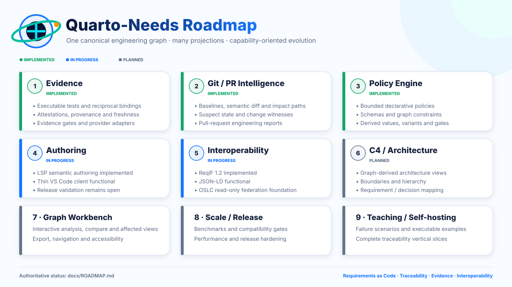

# Quarto-Needs visual identity

The canonical visual identity lives in `docs/assets/branding/`. The project distinguishes **vector masters** from **raster derivatives** so repository documentation, editor packaging, and future releases do not drift into separate visual identities.

## Canonical masters

| Asset | Role |
|---|---|
| `quarto-needs-logo.svg` | Canonical horizontal project mark for repository and documentation surfaces |
| `quarto-needs-symbol.svg` | Canonical compact symbol |
| `quarto-needs-app-icon.svg` | Canonical square application / extension icon artwork |
| `quarto-needs-roadmap-infographic.svg` | Editable presentation snapshot of the capability roadmap |

SVG is the source of truth for reusable artwork. These files are resolution-independent, transparent where appropriate, and use the shared palette directly rather than baking the identity into a low-resolution raster.

## Raster derivatives

| Asset | Intended use |
|---|---|
| `quarto-needs-logo.webp` | Lightweight fallback / presentation derivative of the primary mark |
| `quarto-needs-symbol.webp` | Lightweight fallback / presentation derivative of the compact symbol |
| `quarto-needs-app-icon-256.png` | Packaged application / VS Code extension icon derivative |
| `quarto-needs-roadmap-infographic.webp` | Raster fallback / preview of the vector roadmap |

Raster files are **derived assets**, not independent masters. When the artwork changes, the SVG source should change first and the raster derivatives should be regenerated from it. `editors/vscode/icon.png` must remain visually equivalent to `quarto-needs-app-icon-256.png` rather than becoming a separate icon design.

## Palette

The visual system is organized around:

- Deep Navy — `#0B1230`
- Vivid Blue — `#1677FF`
- Cyan — `#00E6FF`
- Teal — `#00BFA5`
- Orange — `#FF9A00`

The blue/cyan/teal range carries the documentation, graph, and engineering identity. Orange is an accent for nodes, evidence, and points of emphasis.

## Visual semantics

The mark combines four ideas that recur throughout Quarto-Needs:

- a **document** for executable engineering documentation;
- a **gear / inspection motif** for engineering governance;
- **connected nodes** for typed traceability and the canonical property graph;
- an **orbital path** for relationships, traversal, change impact, and evidence flow.

The compact symbol deliberately keeps these ideas recognizable without relying on the wordmark. The application icon places the same symbol inside a bounded square surface rather than introducing a different emblem.

## Usage rules

1. Prefer `quarto-needs-logo.svg` for README, website, Quarto, and scalable documentation surfaces.
2. Prefer `quarto-needs-symbol.svg` where the full wordmark is too wide.
3. Use the app icon artwork only for application / editor-extension contexts.
4. Use `quarto-needs-roadmap-infographic.svg` as the editable roadmap artwork; treat the WebP as a derived preview.
5. Do not stretch artwork non-proportionally or recolor individual elements ad hoc.
6. Keep sufficient clear space around the mark; do not place body text over the symbol or orbital path.
7. Do not treat generated raster variants as new source artwork.
8. Preserve the canonical palette unless a deliberately documented monochrome/accessibility variant is introduced.

## Roadmap artwork

The infographic is a **branding and presentation snapshot**, not the authoritative source of implementation status. [`ROADMAP.md`](ROADMAP.md) is the capability roadmap and takes precedence whenever text and artwork diverge.

The vector artwork intentionally follows the current capability structure—implemented evidence/Git/policy phases, authoring and interoperability in progress, and later architecture/workbench/scale/self-hosting phases planned—while avoiding a second machine-readable source of truth for roadmap status.

## Semantic boundary

The visual identity is presentation-only. It does not introduce or imply a second semantic model: Quarto-Needs remains governed by the canonical Python engineering graph described by the architecture and roadmap.
