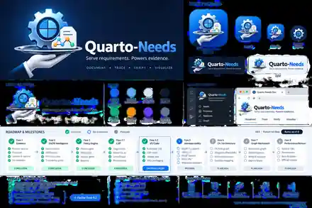

# Quarto-Needs visual identity

This directory contains the shared visual identity assets for Quarto-Needs.

## Asset map

| Asset | Intended use |
|---|---|
| `quarto-needs-logo.webp` | Primary horizontal project mark for repository and documentation surfaces |
| `quarto-needs-symbol.webp` | Compact project symbol for smaller documentation surfaces |
| `quarto-needs-app-icon-256.png` | Square application/extension icon; also used by the thin VS Code client |
| `quarto-needs-roadmap-infographic.webp` | Presentation-oriented visual roadmap snapshot |

The source artwork also includes a larger brand board and high-resolution originals outside the repository-optimized set. Repository copies are intentionally compressed to keep Git history and packaged artifacts small.

## Palette

The current visual system is organized around:

- Deep Navy — `#0B1230`
- Vivid Blue — `#1677FF`
- Cyan — `#00E6FF`
- Teal — `#00BFA5`
- Orange — `#FF9A00`

The blue/cyan/teal range carries the documentation, graph, and engineering identity; orange is an accent for nodes, evidence, and points of emphasis.

## Roadmap artwork

The infographic is a **branding and presentation snapshot**, not the authoritative source of implementation status. [`ROADMAP.md`](ROADMAP.md) is the current capability roadmap and takes precedence whenever the text and artwork diverge.

## Visual semantics

The mark combines four ideas that recur throughout the project:

- a document for executable engineering documentation;
- a gear / inspection motif for engineering governance;
- connected nodes for typed traceability and the canonical property graph;
- an orbital path for relationships, traversal, change impact, and evidence flow.

The visual identity is presentation-only. It does not introduce or imply a second semantic model: Quarto-Needs remains governed by the canonical Python engineering graph described by the architecture and roadmap.
