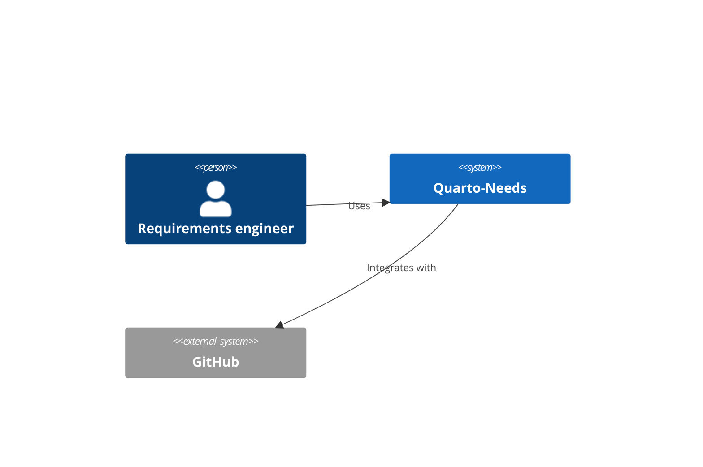

# Quarto-Needs — Spec: Multi-backend C4 Architecture Projections

## Status

Proposed implementation specification. Supplied by the project owner on 2026-09-02.

Implemented by two plans:

- `docs/superpowers/plans/2026-09-02-phase-6b-c4-ir-and-renderer-boundary.md` (Plan A — sections 1-10, 14-15, 17-21, 23-29, 32-34, 43-49, 51-55; spec Tasks 1-5, 9, 10)
- `docs/superpowers/plans/2026-09-02-phase-6c-c4-additional-renderers.md` (Plan B — sections 11-13, 16, 22, 30, 35-42, 50; spec Tasks 6-8, 11, 12)

## Owner decisions recorded at planning time (2026-09-02)

1. **Two plans, not one.** Plan A establishes the renderer-independent boundary
   and keeps Mermaid working end to end; Plan B adds the other three backends
   behind that boundary. Plan A is complete, shippable software on its own.
2. **Source generation only in this milestone.** No adapter shells out to
   `structurizr-cli`, `plantuml`, or `d2`. Capabilities report `svg=False`
   until a separately reviewed slice adds process execution under Section 47's
   trust boundary. Section 23's "generate valid source artifacts only" is the
   accepted first milestone.
3. **The `need-c4` shortcode accepts both spellings.** `view=`/`scope=` become
   the canonical, documented spelling; `root=`/`level=` remain accepted aliases
   so the existing self-hosted example and its `quarto render` tests keep
   passing (Section 43).

## Objective

Implement Phase 6 of Quarto-Needs by introducing a **renderer-independent C4 projection model** derived from the canonical Quarto-Needs engineering graph.

The implementation must support multiple interchangeable C4 rendering backends so users can choose the renderer that best fits their environment without changing the authored engineering model.

Initial target backends:

* Mermaid C4
* Structurizr
* C4-PlantUML
* D2

The architecture must remain extensible for future backends such as:

* native SVG rendering;
* ELK-based native rendering;
* Graphviz;
* other architecture visualization formats.

---

# 1. Architectural principle

The most important invariant is:

> C4 semantics belong to Quarto-Needs, not to any renderer.

Do **not** model architecture independently in Mermaid, Structurizr, PlantUML, D2, or another external DSL.

The canonical flow must be:

```text
Authored Quarto-Needs objects
          ↓
Canonical typed engineering graph
          ↓
C4 semantic projection
          ↓
Renderer-independent C4 IR
          ↓
    Renderer adapters
          ↓
Mermaid / Structurizr / PlantUML / D2
```

Not:

```text
Quarto-Needs
    ↓
Structurizr model
    ↓
C4
```

and not:

```text
Quarto-Needs
    ↓
Mermaid C4 semantics
```

Renderer-specific representations are projections only.

---

# 2. Existing architectural invariants

Preserve all existing Quarto-Needs design rules.

In particular:

1. Python remains the semantic authority.
2. Lua, JavaScript, Quarto and external tools consume projections.
3. The canonical typed property graph remains the single source of engineering truth.
4. C4 views must be generated from existing architecture objects and relations.
5. Renderers must not reinterpret graph semantics.
6. Rendering must be deterministic for an identical project/configuration.
7. Interactive rendering remains progressive enhancement.
8. Static publication must remain possible.
9. Renderer-specific failures must not corrupt the canonical model.
10. External formats remain adapters, not authoring formats.

---

# 3. Scope

Implement generated C4 projections for:

```text
Level 1 — System Context
Level 2 — Container
Level 3 — Component
Level 4 — Code
```

The first implementation must focus on the static hierarchy.

Dynamic and Deployment views should have architectural extension points but may remain deferred until the static model is stable.

---

# 4. Canonical C4 concepts

Introduce explicit semantic roles sufficient to represent:

```text
Person
SoftwareSystem
ExternalSystem
Container
Component
CodeElement
SystemBoundary
ContainerBoundary
Relationship
Interface
```

Do not require a renderer to infer these concepts from arbitrary strings.

Prefer typed semantic roles in the canonical analysis layer.

Possible conceptual representation:

```python
class C4ElementRole(Enum):
    PERSON = "person"
    SOFTWARE_SYSTEM = "software-system"
    EXTERNAL_SYSTEM = "external-system"
    CONTAINER = "container"
    COMPONENT = "component"
    CODE = "code"
```

A boundary is a projection concept derived from hierarchy/containment rather than an unrelated diagram object wherever possible.

---

# 5. Hierarchy

The C4 model must support the hierarchy:

```text
Software System
    └── Container
            └── Component
                    └── Code
```

People and external systems generally exist outside this containment hierarchy.

Relationships between any valid architectural elements must remain represented by canonical graph edges.

Example:

```text
Person
  ↓ uses
SoftwareSystem
  ↓ contains
Container
  ↓ contains
Component

Component
  ↓ calls
ExternalSystem
```

---

# 6. Renderer-independent C4 IR

Create a dedicated renderer-independent intermediate representation.

Suggested location:

```text
src/quarto_needs/c4/
```

Suggested structure:

```text
src/quarto_needs/c4/
├── __init__.py
├── model.py
├── projection.py
├── validation.py
├── serialize.py
└── renderers/
    ├── __init__.py
    ├── base.py
    ├── mermaid.py
    ├── structurizr.py
    ├── plantuml.py
    └── d2.py
```

Exact names may differ if existing repository conventions suggest a better layout.

---

# 7. Proposed IR

The internal representation should look conceptually like:

```python
@dataclass(frozen=True)
class C4Element:
    id: str
    role: C4ElementRole
    name: str
    description: str | None
    technology: str | None
    parent_id: str | None
    external: bool
    tags: tuple[str, ...]
```

```python
@dataclass(frozen=True)
class C4Relationship:
    id: str
    source_id: str
    target_id: str
    description: str | None
    technology: str | None
    relation_type: str
    tags: tuple[str, ...]
```

```python
@dataclass(frozen=True)
class C4View:
    id: str
    level: Literal[
        "system-context",
        "container",
        "component",
        "code",
    ]
    scope_id: str | None
    elements: tuple[C4Element, ...]
    relationships: tuple[C4Relationship, ...]
```

Potential optional metadata:

```python
title
description
direction
layout_hint
include_external
max_depth
```

Avoid embedding renderer-specific concepts such as:

```text
PlantUML macros
Mermaid syntax
Structurizr identifiers
D2 styles
Graphviz coordinates
```

inside the IR.

---

# 8. Projection layer

Implement something conceptually equivalent to:

```python
project_c4(
    analysis_snapshot,
    level,
    scope=None,
    query=None,
) -> C4View
```

The projection layer must:

* consume the canonical analyzed graph;
* identify architecture elements according to canonical roles;
* resolve hierarchy;
* resolve external systems;
* select relevant relationships;
* construct the requested C4 view;
* validate references;
* return immutable deterministic output.

It must not:

* render;
* position nodes;
* decide SVG coordinates;
* emit Mermaid;
* emit Structurizr;
* emit PlantUML;
* emit D2.

---

# 9. Renderer interface

Create a common renderer protocol.

For example:

```python
class C4Renderer(Protocol):

    name: str

    def render(
        self,
        view: C4View,
        options: C4RenderOptions,
    ) -> C4RenderResult:
        ...
```

Possible result:

```python
@dataclass(frozen=True)
class C4RenderResult:
    renderer: str
    source_format: str
    source: str
    artifact_path: Path | None
    diagnostics: tuple[C4Diagnostic, ...]
```

The renderer consumes **only the C4 IR**.

It must not receive the original engineering graph and independently rediscover architecture semantics.

---

# 10. Mermaid backend

Keep Mermaid because it provides:

* no additional architectural toolchain;
* strong Quarto integration;
* easy HTML/static rendering;
* useful fallback/default installation path.

Support at least:

```text
C4Context
C4Container
C4Component
```

and `C4Code` if Mermaid support and output quality are acceptable.

The Mermaid adapter should only translate:

```text
C4View → Mermaid source
```

Example conceptual result:



Do not expose Mermaid-specific semantics to the canonical graph.

---

# 11. Structurizr backend

Implement Structurizr as a first-class backend.

Prefer output that can be consumed by the open Structurizr ecosystem.

Initially support either:

```text
Structurizr DSL
```

or:

```text
Structurizr workspace JSON
```

If feasible, support both eventually.

The adapter must translate:

```text
C4 IR
   ↓
Structurizr representation
```

Use automatic layout when available.

Configuration should allow:

```text
top-bottom
bottom-top
left-right
right-left
```

but these remain presentation hints.

Structurizr must never become the source of architecture identity.

---

# 12. C4-PlantUML backend

Generate valid C4-PlantUML source.

Example conceptual mapping:

```text
Person
System
System_Ext
Container
Container_Ext
Component
Rel
```

The output should permit Graphviz/PlantUML automatic layout.

Where supported, allow renderer-specific layout hints through options rather than through the canonical model.

For example:

```toml
[architecture.c4.renderers.plantuml]
direction = "left-right"
```

---

# 13. D2 backend

Implement D2 as another rendering adapter.

D2 does not need to define C4 semantics.

Instead:

```text
Quarto-Needs C4 semantics
          ↓
D2 representation
          ↓
D2 layout engine
```

The D2 backend should preserve:

* C4 hierarchy;
* boundaries;
* relationship labels;
* element roles.

Where available, allow selection of the D2 layout engine:

```text
dagre
elk
tala
```

Do not require proprietary layout engines.

---

# 14. Renderer registry

Implement a registry rather than hardcoded conditionals scattered through the code.

Conceptually:

```python
C4_RENDERERS = {
    "mermaid": MermaidRenderer(),
    "structurizr": StructurizrRenderer(),
    "plantuml": PlantUMLRenderer(),
    "d2": D2Renderer(),
}
```

Prefer an extensible registry API.

For example:

```python
register_c4_renderer(name, renderer)
```

This creates a clean extension point for future backends.

---

# 15. Configuration

Extend `.quarto-needs.toml`.

Suggested interface:

```toml
[architecture.c4]
renderer = "mermaid"
```

Allow:

```toml
[architecture.c4]
renderer = "structurizr"
```

or:

```toml
[architecture.c4]
renderer = "plantuml"
```

or:

```toml
[architecture.c4]
renderer = "d2"
```

---

# 16. Multiple renderers

Also support multiple renderers.

Example:

```toml
[architecture.c4]
default_renderer = "structurizr"
renderers = [
  "structurizr",
  "mermaid",
  "plantuml",
  "d2",
]
```

The default renderer is used by Quarto when no explicit renderer is requested.

Other renderers may produce side artifacts.

---

# 17. Renderer-specific options

Use namespaced configuration.

Example:

```toml
[architecture.c4.renderers.mermaid]
direction = "top-bottom"

[architecture.c4.renderers.structurizr]
direction = "left-right"
auto_layout = true

[architecture.c4.renderers.plantuml]
direction = "left-right"

[architecture.c4.renderers.d2]
layout = "elk"
```

These options must be presentation-only.

Changing them must not change:

* object identity;
* relation semantics;
* graph meaning;
* requirements traceability.

---

# 18. Quarto shortcode

Introduce a high-level shortcode.

Preferred syntax:

```qmd

```

Other examples:

```qmd

```

```qmd

```

Explicit renderer override:

```qmd

```

The shortcode must not implement C4 semantics in Lua.

Lua must request/use an already resolved semantic projection.

---

# 19. Renderer selection precedence

Use deterministic precedence:

```text
shortcode renderer=
        ↓
view-specific configuration
        ↓
architecture.c4.default_renderer
        ↓
project default
        ↓
mermaid
```

Document this clearly.

---

# 20. CLI

Add an explicit CLI surface.

Examples:

```bash
quarto-needs c4 render
```

```bash
quarto-needs c4 render \
  --view system-context
```

```bash
quarto-needs c4 render \
  --view container \
  --scope SYS-QUARTO-NEEDS
```

Renderer selection:

```bash
quarto-needs c4 render \
  --renderer structurizr
```

Multiple:

```bash
quarto-needs c4 render \
  --renderer mermaid \
  --renderer structurizr
```

All:

```bash
quarto-needs c4 render --all
```

---

# 21. IR inspection CLI

Provide a renderer-independent debugging/export mode.

For example:

```bash
quarto-needs c4 project \
  --view system-context \
  --format json
```

Output:

```json
{
  "schema": "quarto-needs-c4-view-v1",
  "level": "system-context",
  "elements": [],
  "relationships": []
}
```

This is important because it allows testing the semantic projection separately from any renderer.

---

# 22. Generated artifacts

Use deterministic generated artifact locations.

Example:

```text
.quarto-needs/
└── c4/
    ├── system-context/
    │   ├── view.json
    │   ├── mermaid.mmd
    │   ├── structurizr.dsl
    │   ├── plantuml.puml
    │   └── d2.d2
    │
    ├── container/
    │   └── ...
    │
    └── component/
        └── ...
```

Avoid generated artifacts becoming canonical authored data.

---

# 23. Rendering versus source generation

Distinguish carefully between:

```text
projection
source generation
rendering
```

Example:

```text
Canonical graph
     ↓
C4View
     ↓
Structurizr DSL
     ↓
Structurizr renderer
     ↓
SVG
```

The first milestone does not necessarily need to internally execute every external renderer.

It is acceptable for some adapters initially to generate valid source artifacts only.

For example:

```text
Mermaid:
source + embedded Quarto rendering

Structurizr:
DSL generation

PlantUML:
.puml generation

D2:
.d2 generation
```

Actual SVG execution can be added where local tooling is available and safely detectable.

---

# 24. Dependency policy

Do not make every renderer a mandatory dependency.

Mermaid should remain usable with the normal Quarto environment.

Other renderer toolchains should be optional.

For example:

```text
Structurizr unavailable
    → source generation still works if possible
    → direct SVG rendering unavailable

PlantUML unavailable
    → .puml generation still works

D2 unavailable
    → .d2 generation still works
```

Do not fail the entire Quarto-Needs analysis because an optional visualization binary is absent.

---

# 25. Capability detection

Expose renderer capabilities.

Conceptually:

```python
RendererCapabilities(
    source=True,
    svg=True,
    png=False,
    auto_layout=True,
    interactive=False,
)
```

This permits graceful selection.

CLI possibility:

```bash
quarto-needs c4 renderers
```

Output conceptually:

```text
renderer       source   render   auto-layout
------------------------------------------------
mermaid        yes      yes      limited
structurizr    yes      yes*     yes
plantuml       yes      yes*     yes
d2             yes      yes*     yes
```

`*` dependent on local tooling.

---

# 26. Fallback behavior

Do not silently switch renderer unless explicitly configured.

Preferred behavior:

```text
requested Structurizr
        ↓
Structurizr unavailable
        ↓
diagnostic explaining why
```

Optional fallback may be enabled:

```toml
[architecture.c4]
renderer = "structurizr"
fallback_renderer = "mermaid"
```

Then explicitly report that fallback occurred.

Never hide the fact that another renderer was used.

---

# 27. Determinism

For the same:

```text
canonical graph
+
C4 projection configuration
+
renderer configuration
```

the generated textual representation must be byte-deterministic wherever reasonably possible.

Guarantee deterministic:

* node ordering;
* relationship ordering;
* generated identifiers;
* boundary ordering;
* output paths;
* serialization.

Do not depend on Python set/dict incidental ordering.

---

# 28. Stable renderer IDs

Renderer-specific identifiers must be derived deterministically from canonical Quarto-Needs IDs.

Example:

```text
SYS-QUARTO-NEEDS

→ Mermaid: SYS_QUARTO_NEEDS
→ PlantUML: SYS_QUARTO_NEEDS
→ Structurizr: SYS_QUARTO_NEEDS
```

Maintain a deterministic sanitization function.

Never use random IDs.

---

# 29. Validation

Before rendering, validate the C4 projection.

Examples of errors:

```text
container without parent software system

component without container

code element without component

relationship referencing unknown node

containment cycle

duplicate projected ID

invalid scope

system-context projection containing forbidden nested elements
```

Diagnostics should identify canonical Quarto-Needs object IDs.

---

# 30. View semantics

## System Context

Include:

```text
selected software system
people interacting with it
external systems interacting with it
relevant relationships
```

Do not include containers/components by default.

---

## Container

Include:

```text
software-system boundary
containers belonging to that system
relevant people/external systems
relationships
```

---

## Component

Include:

```text
selected container boundary
components belonging to it
external dependencies relevant to those components
relationships
```

---

## Code

Include:

```text
selected component boundary
code-level architectural elements
relationships
```

Do not infer source code structure automatically in the first milestone unless those elements are explicitly represented in the engineering graph.

---

# 31. Relationship semantics

Renderer adapters must preserve semantic relationship direction.

For example:

```text
A depends-on B
```

must not become:

```text
B depends-on A
```

because a renderer prefers that direction visually.

Layout direction is not semantic direction.

Very important distinction:

```text
semantic edge direction
        ≠
layout orientation
```

---

# 32. Layout abstraction

Introduce renderer-neutral layout preferences only when they make sense.

For example:

```python
class LayoutDirection(Enum):
    TOP_BOTTOM = "top-bottom"
    BOTTOM_TOP = "bottom-top"
    LEFT_RIGHT = "left-right"
    RIGHT_LEFT = "right-left"
```

The IR may carry:

```text
preferred_layout_direction
```

but must not carry:

```text
x
y
width
height
```

unless a future explicitly designed layout artifact is introduced.

---

# 33. Future native ELK renderer

Design the abstraction so a future renderer can do:

```text
C4View
  ↓
ELK graph
  ↓
ELK layout
  ↓
SVG
```

without changing C4 semantics.

Do **not** implement a large native SVG engine in this milestone unless required by a separate approved task.

But ensure the interfaces do not prevent it.

---

# 34. Renderer-neutral tests

The most important test suite should test:

```text
canonical graph
        ↓
C4 IR
```

independently of renderer output.

Test:

* correct element selection;
* correct hierarchy;
* external-system classification;
* relationship direction;
* scope filtering;
* stable ordering;
* missing parent detection;
* cycle detection;
* deterministic serialization.

---

# 35. Renderer contract tests

For every renderer, run the same semantic fixture.

Example fixture:

```text
Person: Requirements engineer

Software system:
Quarto-Needs

External systems:
GitHub
OSLC-compatible RM tool

Containers:
Python semantic core
Quarto extension
CLI

Components:
Parser
Analyzer
Rule engine
Graph projection
```

Generate all renderers from the same `C4View`.

Assert that every output represents the same:

```text
element IDs
element roles
relationships
hierarchy
```

---

# 36. Renderer syntax validation

Whenever practical, validate generated syntax with the real target tool.

Examples:

```text
Mermaid parser/render
PlantUML
Structurizr parser
D2 parser
```

Tests should be optional/skippable only when an external executable is genuinely unavailable.

The source-generation unit tests themselves must always run.

---

# 37. Golden tests

Add reviewed goldens for representative outputs:

```text
tests/golden/c4/
├── system-context.json
├── system-context.mmd
├── system-context.dsl
├── system-context.puml
└── system-context.d2
```

Do not automatically rewrite goldens during tests.

A mismatch must fail.

---

# 38. Renderer parity test

Add an explicit renderer parity test.

The test should prove:

```text
Mermaid
Structurizr
PlantUML
D2
```

were generated from the exact same C4 IR fingerprint.

For example:

```text
c4_projection_sha256
```

should be recorded in generated artifact metadata or test state.

---

# 39. `--all` as architecture validation

Treat:

```bash
quarto-needs c4 render --all
```

as more than convenience.

It is an architectural invariant test.

If every renderer can consume the same C4 IR, this provides evidence that renderer-specific semantics have not leaked into the canonical model.

---

# 40. Self-hosted Quarto-Needs example

Extend:

```text
examples/quarto-needs/
```

to model Quarto-Needs architecture using Quarto-Needs itself.

The existing architecture example should evolve to include:

```text
Person:
Requirements engineer

Software system:
Quarto-Needs

External systems:
GitHub
OSLC-compliant requirements management tool

Containers:
Semantic core
CLI
Quarto extension
LSP server
VS Code client

Components where appropriate.
```

Use truthful architecture only.

Do not invent architecture merely to make the C4 diagram richer.

---

# 41. Generated C4 section

The self-hosted documentation should contain something conceptually like:

```markdown
## Generated C4 views

### System Context



### Containers



### Components


```

---

# 42. Renderer comparison showcase

Add a documentation/demo page that generates the **same System Context view** using all supported renderers.

For example:

```markdown
## Mermaid



## Structurizr



## C4-PlantUML



## D2


```

This page is valuable both as documentation and as an integration fixture.

---

# 43. Backward compatibility

Do not break existing:

```text
need-graph
need-flow
Mermaid graph rendering
Cytoscape graph exploration
architecture decision views
```

`need-c4` must be a new semantic projection family.

Existing generic graph views must continue to work.

---

# 44. Distinguish graph views from C4 views

These concepts are related but different.

```text
need-graph
```

means:

> Show some portion of the engineering graph.

```text
need-c4
```

means:

> Interpret selected architecture-role nodes through the formal C4 projection rules.

Do not make every generic graph a C4 graph.

---

# 45. Do not infer C4 from styling

Avoid rules such as:

```python
if node.color == "blue":
    role = SYSTEM
```

or:

```python
if "container" in title.lower():
    ...
```

C4 roles must be explicit/canonical.

---

# 46. Error diagnostics

Examples:

```text
C4001
Container CONT-API has no parent software system.

C4002
Component COMP-PARSER references unknown parent CONT-CORE.

C4003
Containment cycle detected:
SYS-A → CONT-B → SYS-A

C4004
Renderer 'structurizr' is not available for direct rendering.

C4005
Renderer 'd2' generated source but local D2 executable was not found.
```

Follow existing Quarto-Needs diagnostic conventions where possible.

---

# 47. Security

Renderer execution is a trust boundary.

Do not:

* execute arbitrary user-provided shell commands;
* construct unsafe shell strings;
* pass unescaped graph content to shell;
* allow renderer config to define executable code.

When invoking binaries:

```python
subprocess.run(
    [...],
    shell=False,
)
```

with bounded:

* timeout;
* output size;
* working directory.

Generated source should be treated as data.

---

# 48. Offline behavior

Source generation must work offline.

Do not require:

```text
remote Structurizr service
remote Mermaid renderer
external SaaS
remote PlantUML server
```

for core functionality.

Local renderers are preferred.

---

# 49. Documentation

Document:

```text
C4 semantic model
C4 hierarchy
supported views
renderer selection
renderer installation
layout options
fallback behavior
CLI
Quarto shortcode
generated artifacts
known renderer limitations
```

Explicitly explain:

> Different renderers may produce different geometry and styling while representing the same architecture semantics.

---

# 50. Mermaid limitation documentation

Document Mermaid as the easiest zero-configuration renderer, but clarify that its C4 layout is less sophisticated than alternatives.

Do not treat this as semantic weakness.

It is a layout/rendering limitation.

---

# 51. Acceptance criteria

The milestone is complete when all of the following are true.

### Semantic layer

* [ ] C4 roles are represented canonically.
* [ ] System/container/component/code hierarchy is validated.
* [ ] `C4View` is renderer-independent.
* [ ] System Context projection works.
* [ ] Container projection works.
* [ ] Component projection works.
* [ ] Code projection has at least a defined and tested semantic contract.

### Renderers

* [ ] Mermaid adapter works.
* [ ] Structurizr adapter works.
* [ ] C4-PlantUML adapter works.
* [ ] D2 adapter works.
* [ ] All four consume exactly the same IR.

### Configuration

* [ ] Default renderer is configurable.
* [ ] Per-view renderer override works.
* [ ] Renderer-specific options are namespaced.
* [ ] Multiple renderers can be enabled.
* [ ] `--all` works.

### CLI

* [ ] `c4 project` works.
* [ ] `c4 render` works.
* [ ] `--renderer` works.
* [ ] `--all` works.
* [ ] invalid renderer gives a useful diagnostic.

### Quarto

* [ ] `need-c4` shortcode exists.
* [ ] renderer can be selected globally.
* [ ] renderer can be overridden locally.
* [ ] self-hosted example renders generated C4 views.

### Tests

* [ ] semantic projection tests exist.
* [ ] hierarchy validation tests exist.
* [ ] deterministic serialization tests exist.
* [ ] one fixture renders through every backend.
* [ ] golden outputs exist.
* [ ] renderer parity test exists.
* [ ] optional real-parser integration tests exist.

### Architecture

* [ ] no renderer receives responsibility for engineering semantics.
* [ ] no second architecture database is introduced.
* [ ] existing graph/flow/Cytoscape views remain compatible.
* [ ] renderer binaries remain optional dependencies.

---

# 52. Suggested implementation sequence

Do not implement all renderer details simultaneously.

Use the following order.

## Task 1 — C4 semantic model

Implement:

```text
C4 roles
C4Element
C4Relationship
C4View
hierarchy validation
```

Tests first.

---

## Task 2 — C4 projection engine

Implement:

```text
System Context
Container
Component
Code contract
```

No renderer yet.

Verify semantic correctness using JSON output.

---

## Task 3 — C4 JSON artifact

Implement:

```bash
quarto-needs c4 project
```

and:

```text
quarto-needs-c4-view-v1
```

This becomes the stable renderer boundary.

---

## Task 4 — renderer protocol and registry

Implement:

```text
C4Renderer
C4RenderOptions
C4RenderResult
renderer registry
capability model
```

---

## Task 5 — Mermaid adapter

Refactor/replace the current Mermaid C4 attempt so it consumes the new IR.

Do not preserve renderer-specific semantic code if it conflicts with the new architecture.

---

## Task 6 — Structurizr adapter

Generate Structurizr DSL or JSON.

Prefer auto-layout.

Add golden tests and real parser validation if practical.

---

## Task 7 — C4-PlantUML adapter

Generate `.puml`.

Add golden tests.

Validate with real PlantUML when available.

---

## Task 8 — D2 adapter

Generate `.d2`.

Support ELK layout configuration where available.

Validate with D2 when available.

---

## Task 9 — CLI

Implement:

```text
c4 project
c4 render
--renderer
--all
```

---

## Task 10 — Quarto integration

Implement:

```qmd

```

Lua must remain presentation-only.

---

## Task 11 — self-hosted architecture

Update:

```text
examples/quarto-needs/
```

with truthful:

```text
Person
SoftwareSystem
ExternalSystem
Container
Component
```

objects and generated C4 views.

---

## Task 12 — renderer parity and integration

Render the same C4 IR through:

```text
Mermaid
Structurizr
PlantUML
D2
```

Verify semantic parity.

---

# 53. Explicit non-goals

Do not implement in this milestone:

* a second architecture database;
* Structurizr as canonical storage;
* manual XY positioning as authored architecture semantics;
* arbitrary executable renderer plugins;
* cloud-only rendering;
* automatic reverse engineering of the entire source tree into C4 Code diagrams;
* a full native ELK/SVG renderer;
* Dynamic views unless static C4 hierarchy is already stable;
* Deployment views unless separately designed.

---

# 54. Design quality bar

A good implementation should make this possible:

```qmd

```

with:

```toml
[architecture.c4]
renderer = "mermaid"
```

and then the user changes only:

```toml
renderer = "structurizr"
```

and obtains another rendering of **the same architectural model**.

No `.qmd` engineering object should need to be rewritten.

No relation should change.

No C4 semantics should change.

Only the projection backend changes.

---

# 55. Core invariant test

The implementation should be able to demonstrate this equality:

```text
C4Projection(canonical_graph)
       ==
C4Projection(canonical_graph)
```

regardless of whether the consumer is:

```text
MermaidRenderer
StructurizrRenderer
PlantUMLRenderer
D2Renderer
```

Or, stated differently:

```text
canonical graph
       │
       ▼
      IR
 ┌─────┼──────┬──────┐
 ▼     ▼      ▼      ▼
MMD   STR    PUML    D2
```

The branching point must occur **after** the semantic projection.

---

# Final implementation directive

Implement this as an extension of the existing Quarto-Needs architecture, not as an isolated diagram feature.

The C4 projection must participate in the same engineering model as:

```text
stakeholder needs
requirements
architecture decisions
risks
interfaces
implementation
tests
evidence
```

This should eventually allow traceability such as:

```text
Stakeholder Need
      ↓
System Requirement
      ↓
Architecture Decision
      ↓
Software System
      ↓
Container
      ↓
Component
      ↓
Implementation
      ↓
Test
      ↓
Evidence
```

C4 is therefore a **semantic architecture projection over the engineering graph**, not merely a prettier diagram generator.
