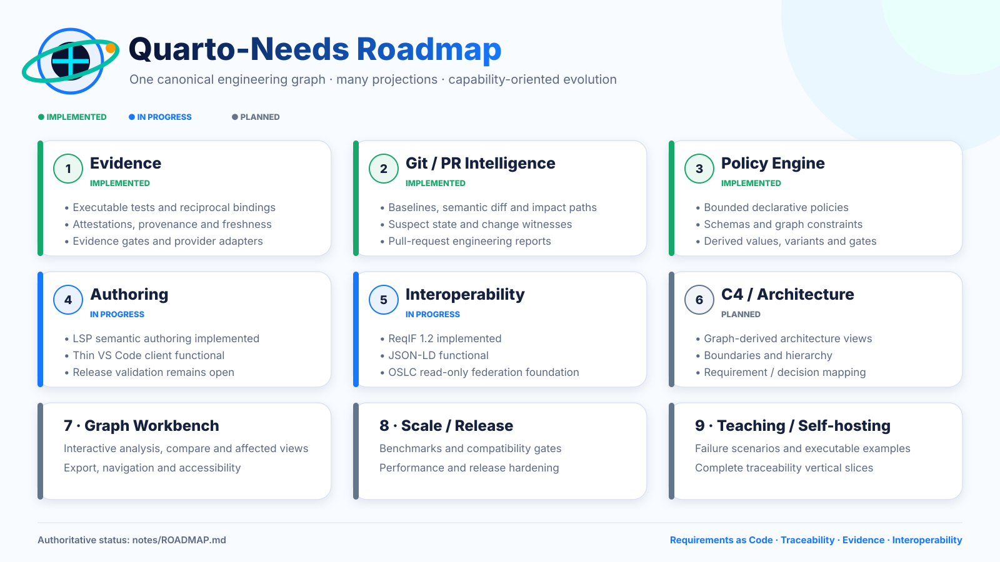

# Quarto-Needs visual identity

The canonical visual identity lives in `notes/assets/branding/`. The project distinguishes **vector masters** from the small set of **raster derivatives required by application packaging**, so repository documentation and editor integrations do not drift into separate visual identities.

## Canonical masters

| Asset | Role |
|---|---|
| `quarto-needs-logo.svg` | Canonical horizontal project mark for repository and documentation surfaces |
| `quarto-needs-symbol.svg` | Canonical compact symbol |
| `quarto-needs-app-icon.svg` | Canonical square application / extension icon artwork |
| `quarto-needs-roadmap-infographic.svg` | Editable presentation snapshot of the capability roadmap |

SVG is the source of truth for reusable artwork. These files are resolution-independent, transparent where appropriate, and use the shared palette directly rather than baking the identity into low-resolution presentation files.

## Raster derivatives

Raster derivatives exist only where a consumer requires them:

| Asset | Intended use |
|---|---|
| `quarto-needs-app-icon-256.png` | Canonical packaged 256 px application / VS Code extension derivative |
| `quarto-needs-app-icon-512.png` | Higher-resolution application / marketplace derivative |
| `editors/vscode/icon.png` | Byte-identical copy of the 256 px derivative used by the VS Code package |

Documentation surfaces should use the SVG masters directly. The old logo/symbol/roadmap WebP fallbacks were retired rather than maintained as unnecessary parallel artwork.

The derivatives are generated from `quarto-needs-app-icon.svg` by `tools/render_branding.py`. To regenerate or verify them:

```bash
make setup-branding
make branding-assets
make branding-check
```

`branding-check` renders fresh temporary derivatives and compares their decoded RGBA pixels and dimensions with the committed files. This avoids false failures caused only by PNG compression differences while still detecting visual drift. The repository regression test separately requires `editors/vscode/icon.png` to remain byte-identical to `quarto-needs-app-icon-256.png`.

## Palette

The visual system is organized around:

- Deep Navy — `#0B1230`
- Vivid Blue — `#1677FF`
- Cyan — `#00E6FF`
- Teal — `#00BFA5`
- Orange — `#FF9A00`

The blue/cyan/teal range carries the documentation, graph, and engineering identity. Orange is an accent for nodes, evidence, and points of emphasis.

## Visual semantics

The mark combines four ideas that recur throughout Quarto-Needs:

- a **document** for executable engineering documentation;
- a **gear / inspection motif** for engineering governance;
- **connected nodes** for typed traceability and the canonical property graph;
- an **orbital path** for relationships, traversal, change impact, and evidence flow.

The compact symbol deliberately keeps these ideas recognizable without relying on the wordmark. The application icon places the same symbol inside a bounded square surface rather than introducing a different emblem.

## Usage rules

1. Prefer `quarto-needs-logo.svg` for README, website, Quarto, and scalable documentation surfaces.
2. Prefer `quarto-needs-symbol.svg` where the full wordmark is too wide.
3. Use `quarto-needs-app-icon.svg` as the source for application/editor-extension artwork; use committed PNG derivatives only where raster input is required.
4. Use `quarto-needs-roadmap-infographic.svg` as the roadmap artwork.
5. Do not stretch artwork non-proportionally or recolor individual elements ad hoc.
6. Keep sufficient clear space around the mark; do not place body text over the symbol or orbital path.
7. Do not treat generated raster variants as new source artwork.
8. Preserve the canonical palette unless a deliberately documented monochrome/accessibility variant is introduced.

## Roadmap artwork



The infographic is a **branding and presentation snapshot**, not the authoritative source of implementation status. [`ROADMAP.md`](ROADMAP.md) is the capability roadmap and takes precedence whenever text and artwork diverge.

The vector artwork intentionally follows the current capability structure—implemented evidence/Git/policy phases, authoring and interoperability in progress, and later architecture/workbench/scale/self-hosting phases planned—while avoiding a second machine-readable source of truth for roadmap status.

## Semantic boundary

The visual identity is presentation-only. It does not introduce or imply a second semantic model: Quarto-Needs remains governed by the canonical Python engineering graph described by the architecture and roadmap.
